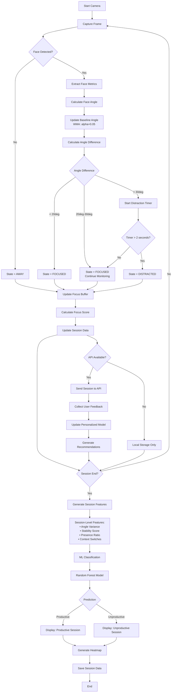
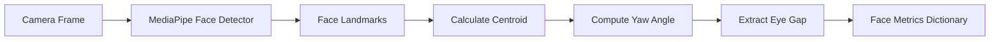
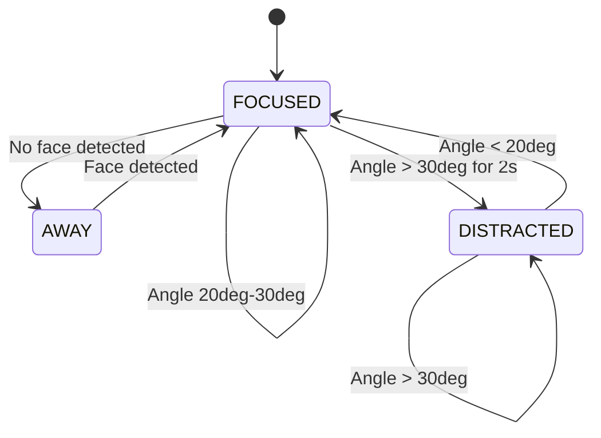
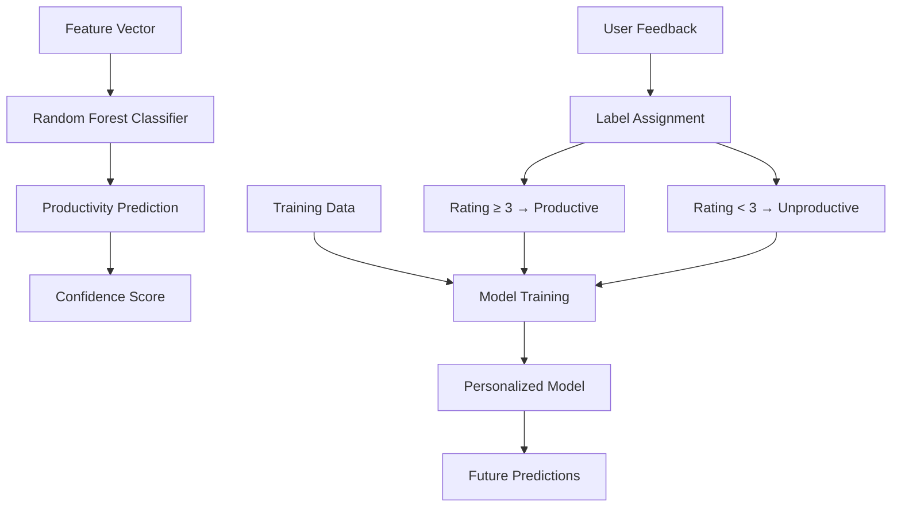
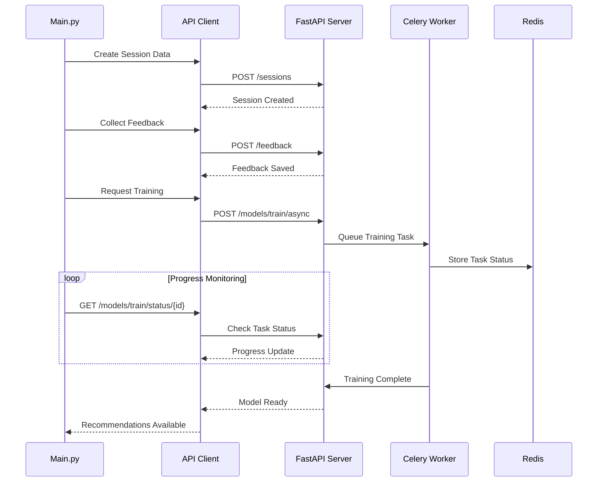
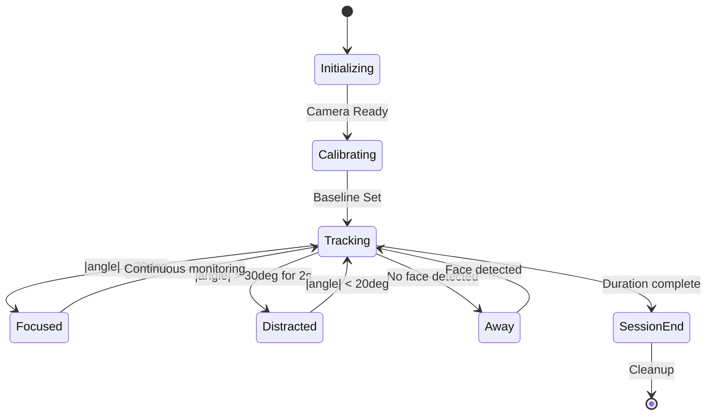
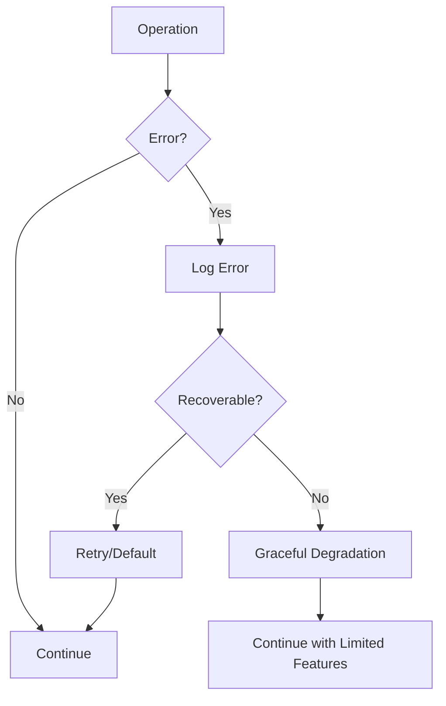

# Focus Tracking Algorithm Flowchart

## System Overview

The Focus Management System uses a multi-layered approach to track user focus through real-time face detection, temporal analysis, and machine learning classification.

## Algorithm Flowchart



## Detailed Component Breakdown

### 1. Real-Time Face Detection



### 2. Tri-State Focus Classifier



### 3. Baseline Angle Calibration

```mermaid
flowchart LR
    A[Current Angle] --> B[Weighted Moving Average]
    B --> C[New Baseline = alpha*Current + (1-alpha)*Old]
    C --> D[alpha = 0.05 (Slow Adaptation)]
    D --> E[Handles Natural Head Movement]
    E --> F[Reduces False Positives]
```

### 4. Session Feature Extraction

```mermaid
flowchart TD
    A[Session Data] --> B[Angle Variance]
    A --> C[Stability Score]
    A --> D[Presence Ratio]
    A --> E[Context Switches]
    
    B --> F[variance(angles)]
    C --> G[1 - CV(angle)]
    D --> H[frames_with_face / total_frames]
    E --> I[state_changes / time]
    
    F --> J[Feature Vector]
    G --> J
    H --> J
    I --> J
    
    J --> K[4-Dimensional Input]
```

### 5. Machine Learning Pipeline



### 6. API Integration Flow



## Algorithm Parameters

### Real-Time Tracking
| Parameter | Value | Purpose |
|-----------|-------|---------|
| Frame Rate | 30 FPS | Smooth video processing |
| Detection Interval | Every frame | Real-time analysis |
| WMA Alpha | 0.05 | Slow baseline adaptation |
| Focus Threshold | 20deg | Focused angle limit |
| Distraction Threshold | 30deg | Distraction trigger |
| Distraction Timer | 2.0 seconds | Confirmation delay |

### Session Analysis
| Feature | Formula | Interpretation |
|---------|---------|-------------|
| Angle Variance | variance(angles) | Movement consistency |
| Stability Score | 1 - CV(angle) | Focus stability |
| Presence Ratio | face_frames / total | Engagement level |
| Context Switches | state_changes / time | Attention shifts |

### ML Classification
| Parameter | Value | Description |
|-----------|-------|-------------|
| Model Type | Random Forest | Ensemble classifier |
| Features | 4 dimensions | Session metrics |
| Training Data | Synthetic + Real | Hybrid approach |
| Personalization | Per-user models | Adaptive learning |

## State Transitions

### Focus State Machine


### Error Handling


## Performance Considerations

### Optimization Points
1. **Frame Processing**: Skip frames if CPU > 80%
2. **Memory Management**: Circular buffers for session data
3. **Model Caching**: Load ML models once per session
4. **Async Operations**: Non-blocking API calls

### Resource Usage
| Component | CPU | Memory | I/O |
|-----------|-----|--------|-----|
| Face Detection | 40-60% | 100-200MB | Camera |
| Feature Extraction | 10-20% | 50-100MB | Minimal |
| ML Inference | 5-15% | 50-150MB | Model loading |
| API Calls | 5-10% | 20-50MB | Network |

This algorithm provides robust focus tracking through real-time computer vision, temporal analysis, and adaptive machine learning.
